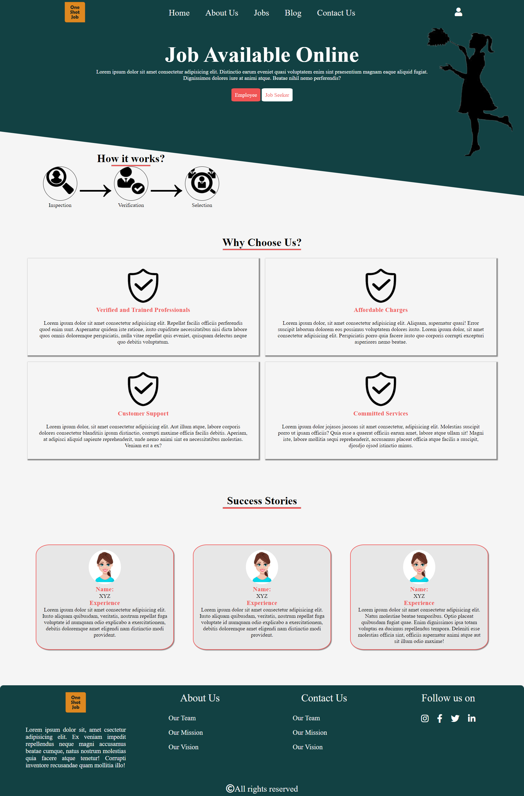
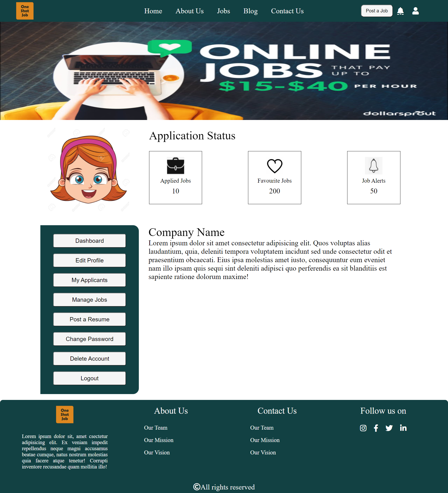
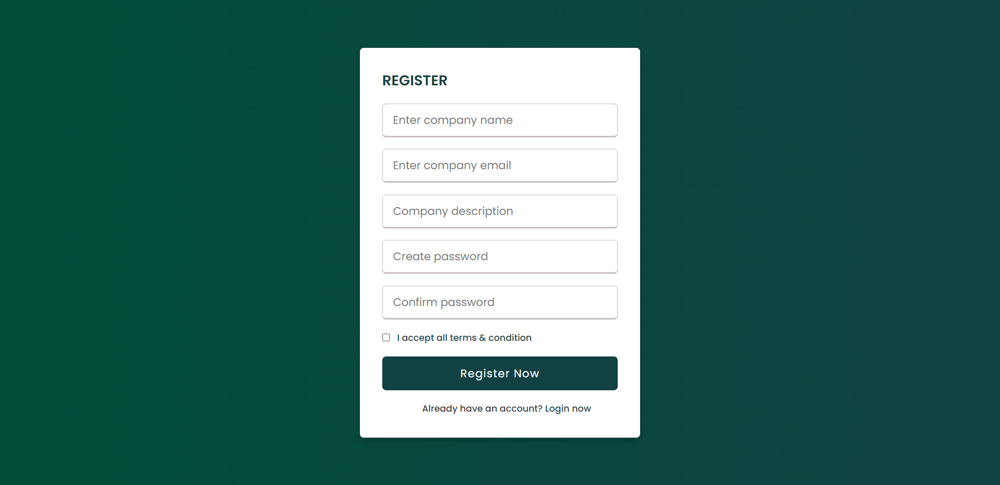
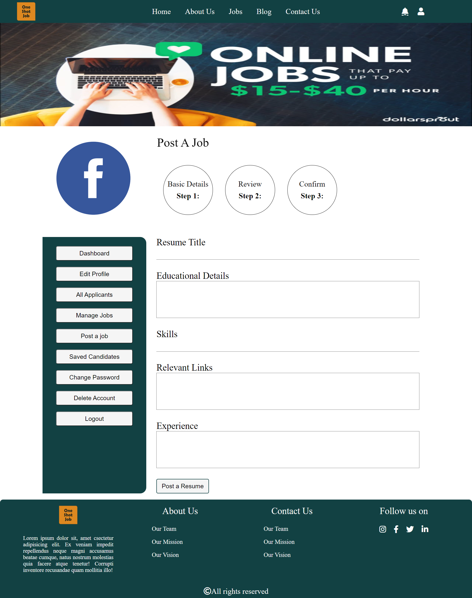
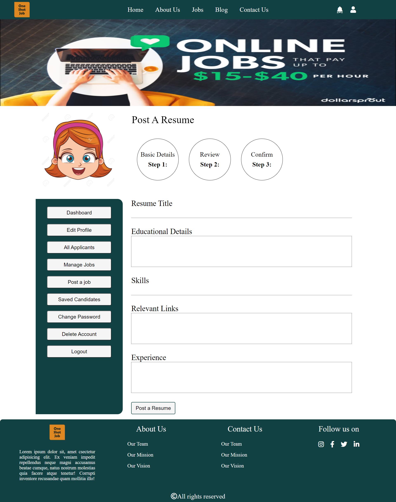

# Jobs_Online_UAcelt

  

<h1 align="center">Restaurant Website</h1>

  
  
  
  

  
  
  
  
  
  
  

# About

The objective of this web application is to act as a bridge between the employer and the jobseekers wherein people who wants to hire employees can directly contact with them and also jobseekers with relevent interest and skill can find jobs easily and of their own interest.

---

We have made the whole process convenient and user-friendly.

Here employer and the jobseekers can come and register themselves. The employers can post jobs for which they want to hire employees. Also the jobseekers can upload their resume so that the employers can see the resume and hire them.

---
<h3 align="left">Technologies Used:</h3>

 
 
 
  
 

---

## Methodology

Our aim is to make the work of employers and easier using this the jobseekr can directly interact with the company and the company can directly connect with the person they want to hire.

---

## Upcoming Features
* Functional Login and Signup
* Jobseekers can post their resume 
* Employers can post a job
* Jobseekers and Employers can give ratings

---

## How to Contribute to Jobs_Online.github.io?

- Take a look at the Existing [Issues](https://github.com/Himanshi1207/Jobs_Online.github.io/issues) or create your own Issues!
- Wait for the Issue to be assigned to you.
- Fork the repository
- Have a look at [Contibuting Guidelines](https://github.com/Himanshi1207/Jobs_Online.github.io/blob/main/CONTRIBUTING.md)

---

### 🌟 Contributors

### Credit goes to these brilliant people ✨✨:

<table>
	<tr>
		<td>
			
		</td>
	</tr>
</table>

